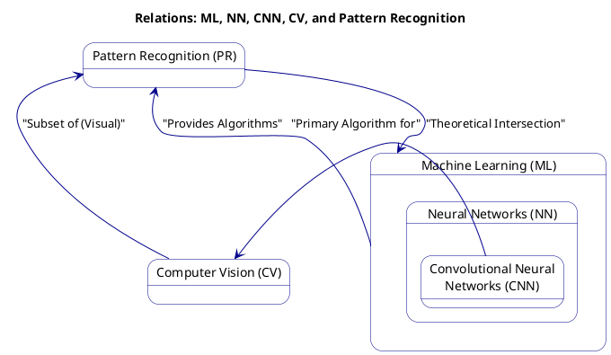

Machine Learning



```plantuml
Bob -> Alice : hello
Alice -> Wonderland: hello
Wonderland -> next: hello
next -> Last: hello
Last -> next: hello
next -> Wonderland : hello
Wonderland -> Alice : hello
Alice -> Bob: hello
```

```javascript  
function add(a, b) {  
return a + b;  
}  
```
